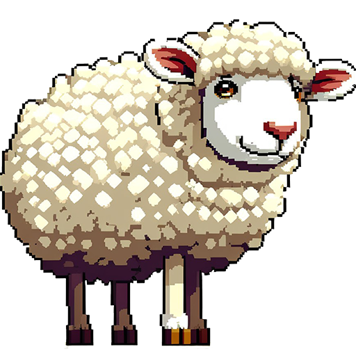
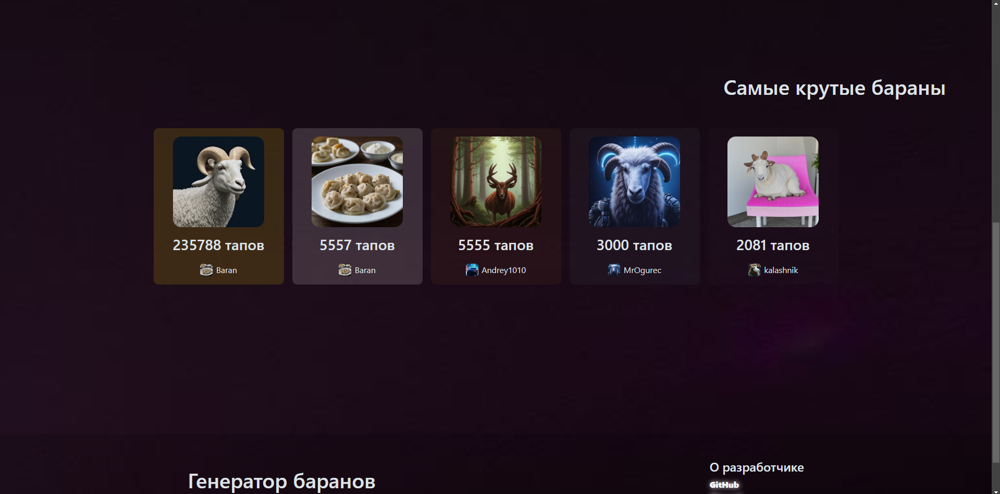
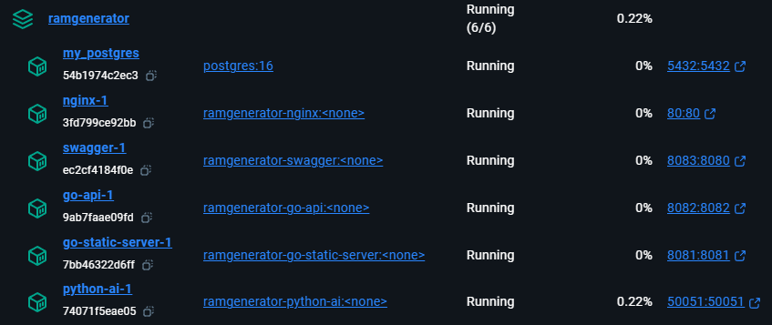

#  RamGenerator
### Сайт для генерации и тапания баранов. https://taprams.ru

#### [English](README.md) Русский

Скриншоты

## API Документация
### Swagger-ui - https://taprams.ru/swagger

## Сайт работает на:
* Контейнерах docker
* База данных - **Postgres**
* **Go** - REST API сервер и сервер для статичных файлов
* **Python** - gRPC сервер, делает запросы к API нейросетей (Gemini для текста, Kandinsky для изображений)
* Frontend без фреймворков, простой js, html, css. Html файлы разделены на шаблоны: base, header, footer и сам контент 
страниц, динамический контент страниц отрисовываются на frontend'е с помощью js.
* Документация на основе [swagger ui](https://taprams.ru/swagger)

### На уровне микросервисов/docker контейнеров это работает так:
* **postgres** - база данных.
* **go-api** - rest api сервер. По умолчанию на порту 8082. [DockerHub repository](https://hub.docker.com/repository/docker/kalashnik/ramgenerator-go-api)
* **go-static-server** - возвращает статичные файлы сайта, рендерит html шаблоны при старте. По умолчанию на порту 8081. [DockerHub](https://hub.docker.com/repository/docker/kalashnik/ramgenerator-go-static-server)
* **swagger** - swagger ui, на порту 8083. [DockerHub](https://hub.docker.com/repository/docker/kalashnik/ramgenerator-swagger)
* **nginx** - объединяет rest api сервер, go-static-server и swagger на порту 80. Api по адресу /api, а swagger ui на /swagger. [DockerHub](https://hub.docker.com/repository/docker/kalashnik/ramgenerator-nginx)
* **python-ai** - gRPC сервер для запросов к нейросетям на порту 50051. [DockerHub](https://hub.docker.com/repository/docker/kalashnik/ramgenerator-python-ai)

## Для запуска
### `docker-compose up`
Если хотите запустить изменённую версию, или просто собрать свои изображения docker, используйте `docker-compose up --build`

### Необходимые переменные окружения (также смотрите [шаблон .env файла](template.env))
#### Для python-ai
`KANDINSKY_KEY`, `KANDINSKY_SECRET_KEY`, `GEMINI_API_KEY`, `GRPC_SECRET_TOKEN`, `GRPC_HOST`, `GRPC_PORT`
`GRPC_SECRET_TOKEN`, `GRPC_HOST`, `GRPC_PORT`

#### Для go-api
`FREE_IMAGE_HOST_API_KEY`, `POSTGRES_DB`, `POSTGRES_USER`, `POSTGRES_PASSWORD`, `POSTGRES_HOST`, 
`GRPC_SECRET_TOKEN`, `GRPC_HOST`, `GRPC_PORT`, `HMAC`

#### Для postgres
`POSTGRES_DB`, `POSTGRES_USER`, `POSTGRES_PASSWORD`, `POSTGRES_HOST`,

#### Для go-static-server
`API_URL`, `WEBSOCKET_PROTOCOL`

### Команды для генерации кода из [proto](proto/ram_generator.proto) файлов:
* `make go-grpc` - только для Go
* `make py-grpc` - только ля Python
* `make grpc` - для Go и Python
