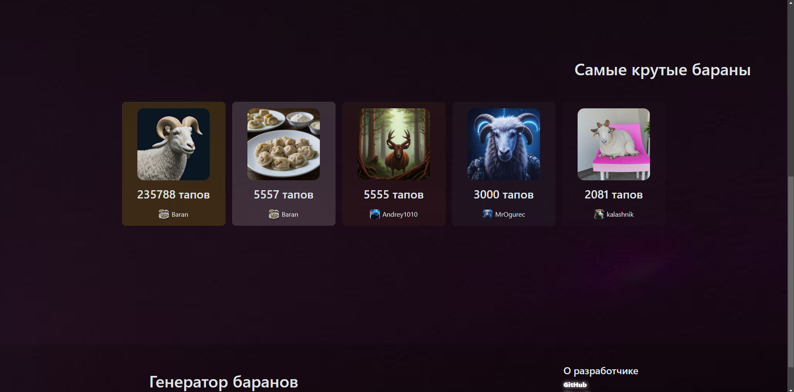
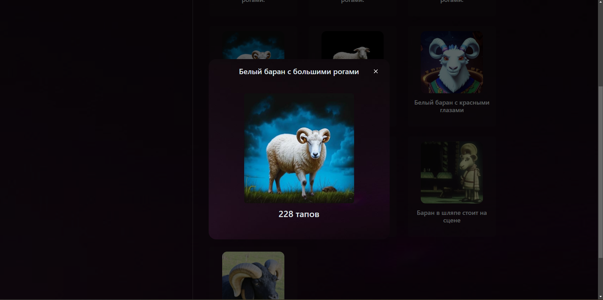
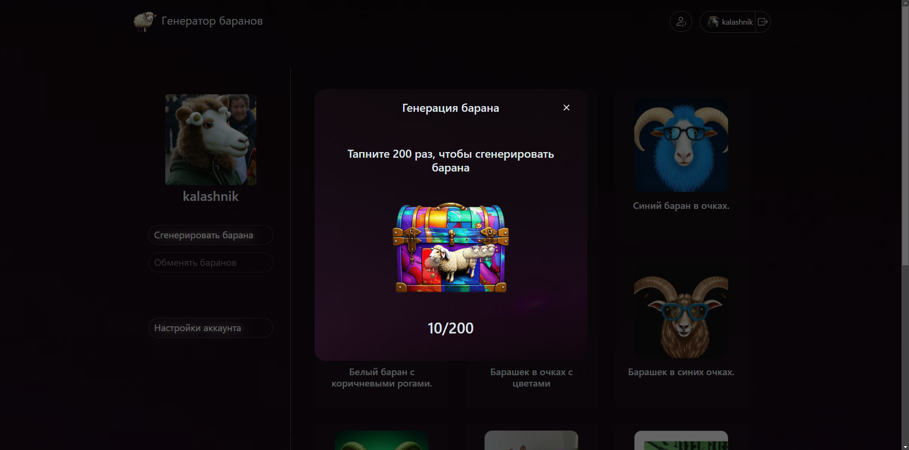
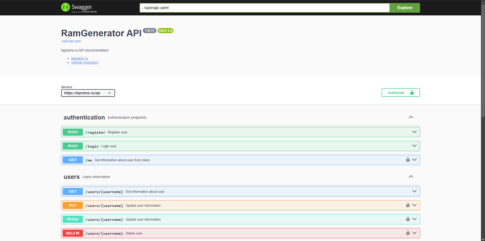
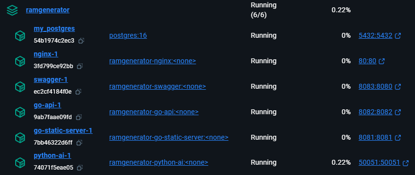

#  RamGenerator
### A site for generating and tapping rams. https://taprams.ru

#### English [Русский](README-RU.md )

Screenshots

## API Documentation
### Swagger-ui - https://taprams.ru/swagger

## The site works on:
* Docker containers
* Database - **Postgres**
* **Go** - REST API server and server static files server.
* **Python** - gRPC server, makes requests to the AI API (Gemini for text, Kandinsky for images)
* Frontend without frameworks, simple js, html, css. Html files are divided into templates: base, header, footer and the
  pages content, dynamic page content is rendered on the frontend using js.
* [Swagger ui](https://taprams.ru/swagger) based documentation

### At the microservices/docker containers level, it works like this:
* **postgres** - database.
* **go-api** - rest api server. By default on port 8082. [DockerHub repository](https://hub.docker.com/repository/docker/kalashnik/ramgenerator-go-api)
* **go-static-server** - returns static site files, renders html templates at startup. By default on port 8081. [DockerHub](https://hub.docker.com/repository/docker/kalashnik/ramgenerator-go-static-server)
* **swagger** - swagger ui, use port 8083. [DockerHub](https://hub.docker.com/repository/docker/kalashnik/ramgenerator-swagger)
* **nginx** - combines api server, go-static-server and swagger on port 80. Api at /api, and swagger ui at /swagger. [DockerHub](https://hub.docker.com/repository/docker/kalashnik/ramgenerator-nginx)
* **python-ai** - gRPC server for requests to ai api's on port 50051. [DockerHub](https://hub.docker.com/repository/docker/kalashnik/ramgenerator-python-ai)

## Launch
### `docker-compose up`

### Necessary environment variables (see alse [template.env](template.env))
#### For python-ai
`KANDINSKY_KEY`, `KANDINSKY_SECRET_KEY`, `GEMINI_API_KEY`, `GRPC_SECRET_TOKEN`, `GRPC_HOST`, `GRPC_PORT`
`GRPC_SECRET_TOKEN`, `GRPC_HOST`, `GRPC_PORT`

#### For go-api
`FREE_IMAGE_HOST_API_KEY`, `POSTGRES_DB`, `POSTGRES_USER`, `POSTGRES_PASSWORD`, `POSTGRES_HOST`,
`GRPC_SECRET_TOKEN`, `GRPC_HOST`, `GRPC_PORT`, `HMAC`

#### For postgres
`POSTGRES_DB`, `POSTGRES_USER`, `POSTGRES_PASSWORD`, `POSTGRES_HOST`,

#### For go-static-server
`API_URL`, `WEBSOCKET_PROTOCOL`

### Generate code from [proto](proto/ram_generator.proto) files:
* `make go-grpc` - only for Go
* `make py-grpc` - only for Python
* `make grpc` - for Go and Python
